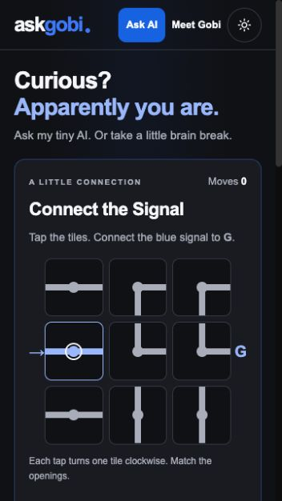

# AskGobi · Curious? Apparently you are.

A mobile-first interactive introduction to Gobi: ask the tiny AI or play a puzzle,
meet the builder, then get in touch. Backed by the existing Next.js, local Ollama, Cloudflare, and
Supabase setup.

[Live demo](https://askgobi.net) · [Chat](https://askgobi.net/chat) ·
[Talk to Gobi on LinkedIn](https://www.linkedin.com/in/gobishankar-rathinam)

The live demo follows the deployed release; the screenshot below shows this
revision's local mobile preview, not a claim that it is already deployed.



## Why I built it this way

I put “Curious? AskGobi.net” on my car to give strangers a reason to explore
something I built. The challenge is to make that first visit enjoyable while
running a small local model on a home computer.

- **Instant, reproducible play:** a seeded generator and exact minimum-rotation
  solver check every board. Enumerating simple entrance-to-exit paths is practical
  on a deliberately small 3×3 board. Generation has a fixed attempt limit and tested
  fallback boards. [Engine](lib/puzzle/engine.ts) · [Solver tests](tests/puzzle.test.ts).
- **Friendly scores, explicit boundaries:** the server replays moves, checks a
  signed two-hour ticket against its frozen board, and atomically retains each
  guest’s best daily result. This prevents fabricated scores, not automated play,
  outside help or multiple identities. [Validation](lib/server/signalSecurity.ts) ·
  [API tests](tests/signal-server.test.ts) · [Database checks](scripts/test-signal-db.mjs).
- **AI assists; it doesn't judge:** the solver supplies the official hint. An
  optional local-model explanation uses that hint, has a 20-second deadline
  including queue time, and shares chat's one-active/three-waiting limit. Model
  failure leaves the deterministic hint usable. This is an **AI-assisted puzzle
  coach**, not an autonomous agent or a verified explanation.
  [Coach](lib/server/signalCoach.ts) · [Fallback/cancellation tests](tests/signal-server.test.ts).

Next.js provides the application, Ollama runs inference, Cloudflare connects the
home host, and Supabase handles private saved conversations. Public play is
separate from those conversations. The home server remains an availability
dependency; this is not an uptime or accuracy guarantee.

## What visitors can do

Phones and tablets keep the single-column play → builder → contact flow. At
1100 CSS pixels and above, the homepage uses a 1160px-wide container with the
activity on the left and builder/contact on the right. Both layouts share the
same components and state: resizing never restarts an active puzzle or quiz.

The **Ask anything** header link uses blue text, a sparkle icon and a small arrow, with no filled background. It
opens the existing chat workspace without needing to play first. A solved puzzle offers **Another signal** and **Chat with my AI**;
daily play, sharing and the curated deck sit under **Daily challenge, sharing & more**.
The game never makes a model request just because someone opens it or follows a
chat link. The header wraps naturally at enlarged text sizes instead of clipping.

- Tap nine straight/elbow tiles to connect the left-hand signal to G. Fresh
  practice boards need 3–6 minimum clockwise rotations. Actual moves, the solver's
  minimum and a local per-board personal best replace invented intelligence scores.
- Recent board fingerprints, up to 100 personal bests and the latest practice run
  stay on the device. Fresh openings avoid recent boards; unfinished progress can
  be resumed explicitly. Storage denial does not prevent play. Theme, resize and
  midnight never change a board already in progress.
- Try the optional daily board (6–10 minimum rotations), shared by UTC date.
  With publishing enabled, choose initials after solving to join the leaderboard.
  Today ranks fewest moves; weekly/all-time sum daily best points. Equal scores
  share rank. Daily points are `floor(100 × minimum / moves)`; maximum 700 per UTC
  Monday–Sunday week. All-time rewards participation as well as efficiency.
- Share exact versioned practice links (`/?puzzle=s1-1234abcd`), daily links
  (`/?daily=2026-08-27`), or existing `/?card=<id>` links. Past daily boards remain
  practice; only current-day starts issue tickets, which survive midnight until
  their two-hour expiry. Shared links never contain tokens, move lists or solutions.
- Explore the existing 10 quizzes, 10 riddles and 10 sourced facts through
  **More surprises**. No gate, sign-in, or model response needed.
- Meet Gobi, open the engineering details, and contact him on LinkedIn.
- Skip a question without earning completion; continue at your own pace.
- Challenge a tiny local AI, then give a clearly self-reported verdict.
- Earn First Spark, Explorer, and Challenger milestones stored on their device.
- Share curated-card links or a milestone, without publishing private questions.
- Ask anything at `/chat`, with one-tap starters, optional sign-in, projects,
  and saved history.

## Development

Use Node 24 LTS (also used by CI). Run `npm ci`, then copy `.env.local.example` to a private
`.env.local` file and configure the existing Ollama/Supabase settings as needed.

```sh
npm run dev
npm test
npm run typecheck
npm run build
npm start
```

For preview and production builds running together on macOS/Linux:

```sh
NEXT_BUILD_DIR=.next-dev npm run dev -- --hostname 127.0.0.1 -p 3100
```

The puzzle, solver hints and curated deck need no AI or database connection. Without Ollama,
challenges show an offline state. Authentication/history remain optional and
separate from public play. No paid inference API is required.

## Configuration

The active model comes from `OLLAMA_MODEL` (default `gemma2:2b`), on
`OLLAMA_HOST` plus the configured `OLLAMA_PORTS` (default 11435). Do not infer
production's model from this default: verify the home server's configuration.
Public copy intentionally says “tiny local AI,” not an unverified parameter count.

Supabase history uses the existing public URL and anon key. Aggregate telemetry is
optional: apply `supabase/curiosity_events.sql`, then the additive
`supabase/curiosity_builder_events.sql` and `supabase/curiosity_signal_events.sql`,
and set the server-only service-role key. Existing installations need only the
migrations not already applied. No raw prompts,
answers, locations, or persistent visitor identifiers are sent
to the event endpoint. Operational logs contain mode, duration, and outcome only.

Leaderboard identities are separate from these aggregate counters. Publishing
creates an opaque HttpOnly cookie; only its SHA-256 hash is stored server-side.
Public entries contain initials plus a discriminator and scores. No guest identity
is created by opening/playing the game. Clearing browser data loses identity access;
identities do not sync between devices. Deletion is available while the cookie
remains, even if publishing has been disabled.

Both services default off. Apply `supabase/signal.sql` in staging, configure a
stable random `SIGNAL_TICKET_SECRET` (at least 32 characters) and verify the server-only
Supabase settings before enabling `SIGNAL_LEADERBOARD_ENABLED=true`.
Independently enable `SIGNAL_COACH_ENABLED=true` only after local-model checks.
Practice continues when either switch is off. Never put secrets in `NEXT_PUBLIC_*`.

Displaying a board is silent. The first rotation counts `puzzle_start`; a solved
run counts `puzzle_complete`; explicit replay counts `puzzle_replay`.
`leaderboard_post` counts confirmed successful posts and `coach_use` counts AI
explanation requests. They do not measure unique players or hiring outcomes.
Displaying an opening/shared card does not start or complete an activity. An
answer/reveal starts and completes that visit; choosing “Surprise me” starts the
next visit. “Skip this one” also selects the next activity but never completes the
skipped card. Completion and milestones are deduplicated. Build-detail opens count
once per page entry; LinkedIn clicks count contact intent, not conversations or
confirmed leads. Telemetry failure does not block play.

Recent quiz IDs from earlier versions remain a separate device-local preference,
not completion history; they are never sent to the server. The full 30-card
continuation deck remains session-local and avoids repeats until exhaustion.

Only enable `TRUST_CLOUDFLARE_PROXY` when direct access to the origin is blocked.
Use one Next.js process; the queue and request throttling are process-local.

## Tests and deployment

The [Verify AskGobi workflow](.github/workflows/ci.yml) runs `npm ci`, regression
tests, isolated PostgreSQL migration checks, TypeScript, and the production build on pushes and pull requests. It has
read-only repository permissions, pins official actions, and needs no production
secrets, Supabase account, or Ollama service. It does not deploy. No passing CI
badge is shown until the workflow has actually run successfully on GitHub.

For the optional database suite, run `npm test`, install `@electric-sql/pglite@0.3.14`
in an isolated temporary directory, then run
`PGLITE_MODULE=/absolute/path/to/node_modules/@electric-sql/pglite/dist/index.js node scripts/test-signal-db.mjs`.
It checks real SQL without accessing Supabase. PGlite serializes operations; real
multi-connection score-update races and deployed grants still require staging checks.
Changing the v1 generator would break existing shares: preserve it and add a new
puzzle version for future rule/generation changes.

See [release instructions](docs/RELEASE.md) for rollout, rollback, authentication
checks, telemetry setup, and the first-week review. A known inherited dependency
security gate must be resolved before public rollout. The feature work does not
migrate hosting or replace the existing private chat database.

Automated tests use in-process synthetic responses and never download or start a
model. One-off local model runners and browser fixtures are not part of the source.
Install Ollama separately on the host and preserve its actual model/port settings.
