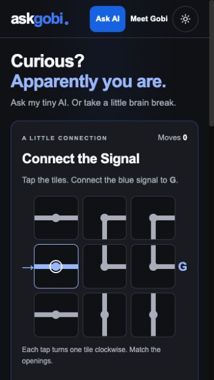

# AskGobi · Curious? Apparently you are.

A mobile-first interactive introduction to Gobi: ask the tiny AI or play a puzzle,
meet the builder, then get in touch. Backed by the existing Next.js, local Ollama, Cloudflare, and
Supabase setup.

[Live demo](https://askgobi.net) · [Chat](https://askgobi.net/chat) ·
[Talk to Gobi on LinkedIn](https://www.linkedin.com/in/gobishankar-rathinam)

The live demo follows the deployed release; the screenshot below shows this
revision's local mobile preview, not a claim that it is already deployed.

## Why I built it this way

I put “Curious? AskGobi.net” on my car to give strangers a reason to explore
something I built. The challenge is to make that first visit enjoyable while
running a small local model on a home computer.

- **Instant, reproducible play:** a seeded generator and exact minimum-rotation
  solver check every board. Enumerating simple entrance-to-exit paths is practical
  on a deliberately small 3×3 board. Generation has a fixed attempt limit and tested
  fallback boards. [Engine](lib/puzzle/engine.ts) · [Solver tests](tests/puzzle.test.ts).
- **Friendly scores, explicit boundaries:** the server replays moves, checks a
  signed two-hour ticket against its frozen board, and atomically retains each
  guest’s best daily result. This prevents fabricated scores, not automated play,
  outside help or multiple identities. [Validation](lib/server/signalSecurity.ts) ·
  [API tests](tests/signal-server.test.ts) · [Database checks](scripts/test-signal-db.mjs).
- **AI assists; it doesn't judge:** the solver supplies the official hint. An
  optional local-model explanation uses that hint, has a 20-second deadline
  including queue time, and shares chat's one-active/three-waiting limit. Model
  failure leaves the deterministic hint usable. This is an **AI-assisted puzzle
  coach**, not an autonomous agent or a verified explanation.
  [Coach](lib/server/signalCoach.ts) · [Fallback/cancellation tests](tests/signal-server.test.ts).

Next.js provides the application, Ollama runs inference, Cloudflare connects the
home host, and Supabase handles private saved conversations. Public play is
separate from those conversations. The home server remains an availability
dependency; this is not an uptime or accuracy guarantee.

## What visitors can do

The homepage leads with a live AI input and three one-tap prompts. Phones use
AI → quick curiosity → daily signal → maker; desktop puts AI beside the supporting
quiz and daily game. Shared card and puzzle URLs put their activity first. Layout
changes preserve the current activity and response.

AI answers stream on the homepage using the same chat hook and server endpoint as
`/chat`. Continue chatting opens the saved conversation for signed-in visitors;
otherwise a bounded, 15-minute tab-local handoff carries up to three completed
exchanges. No question or answer enters a URL. Handoffs are consumed once and
rejected after account changes. When tab storage is unavailable, the visitor can
keep asking inline or open a fresh chat. The labelled Ask Gobi launcher appears
only when the inline AI is off-screen and hides during text entry.

Quiz explanations can seed the AI input with a public card ID; the server resolves
its trusted content. No AI request runs just because a page or game opens.

Install Ollama separately on the host and preserve its actual model/port settings.

### My curiosity

The homepage offers AI questions, a remembered curiosity quiz, and the daily
signal. `/curiosity` brings private saved discoveries, verified completed puzzles,
and recent chats together. Public scores remain optional. Account sync is separately
controlled by `ACCOUNT_SYNC_ENABLED` and requires the additive account migration;
see the release instructions before enabling it. Browser-only practice counts are
never treated as verified leaderboard results.
